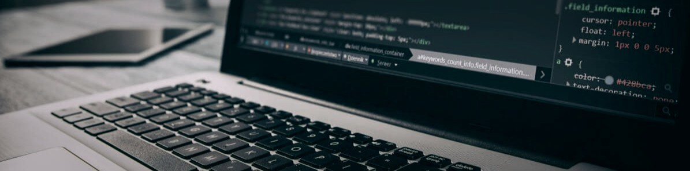

### About me

<!--
**Guillaume-Boeur/Guillaume-Boeur** is a ✨ _special_ ✨ repository because its `README.md` (this file) appears on your GitHub profile.

Here are some ideas to get you started:

- 🔭 I’m currently working on ...
- 🌱 I’m currently learning ...
- 👯 I’m looking to collaborate on ...
- 🤔 I’m looking for help with ...
- 💬 Ask me about ...
- 📫 How to reach me: ...
- 😄 Pronouns: ...
- ⚡ Fun fact: ...
-->

I am currently at the end of a **Web Developer** training at BeCode, in Liège, Belgium and I am looking for an **internship** to gain more skills and a first professional experience as a developer.

Qualified in **graphic design**, I am now following a career path towards **Front-end development**.

Our training had a **full-stack approach** of the web development, with projects going from **design to development**. Thereby, my interest is the web development as a whole.